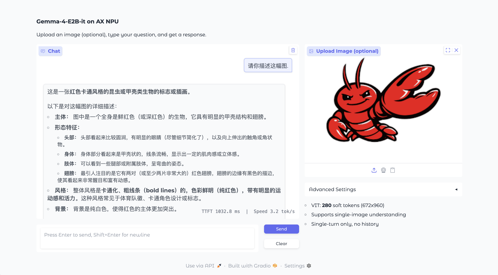

# gemma-4-E2B-it.axera

> `google/gemma-4-E2B-it` 在 `AX650 / NPU3` 上的复现工程。

本仓库的目标是帮助用户完成两类工作：

- 复现板端运行与精度验证
- 重新导出、校准并编译 `Gemma 4 E2B` 的 Vision / Audio / LLM 产物

本仓库面向需要完整复现实验过程、重新编译模型或核对精度的用户。

> 当前仓库中的推理能力均通过 Python 脚本提供，主要用于复现与 Demo 说明；如果你希望直接体验面向用户的实际 Demo，请参考 Hugging Face 发布页：<https://huggingface.co/AXERA-TECH/gemma-4-E2B-it-GPTQ-INT4>。

## 适用范围

- 平台：`AX650 / NPU3`
- 支持的板端能力：
  - 文本对话
  - 单图图文对话
  - 固定时长音频推理（`5s` / `30s`）
  - Gradio 图文 Demo
- 当前 `python/infer_axmodel.py` 不支持同时输入图片和音频
- `python/infer_torch*.py` 脚本仅用于 `x86 + HuggingFace/Torch` 参考验证，不属于板端复现主流程

## 仓库职责

```text
.
├── python/         # 板端运行目录：tokenizer/config、LLM axmodel、VIT axmodel、Audio axmodel、推理脚本
├── model_convert/  # 模型导出、校准、编译与精度 A/B 验证目录
└── assets/         # Demo 使用的示例图片、音频和视频素材
```

根目录 `README.md` 负责说明“如何准备运行目录并在板端复现结果”。
如果你需要重新生成 ONNX、校准数据或 axmodel，请阅读 [model_convert/README.md](./model_convert/README.md)。

## 运行前准备

### 1. 准备运行目录

在执行板端命令前，请确认以下文件已经准备好：

```text
python/
├── gemma-4-E2B-it/                             # tokenizer / config / processor 相关文件，不含原始 safetensors
├── gemma-4-E2B-it_axmodel/                     # 默认 LLM 运行目录
├── vit_models/
│   ├── gemma4_vision_h336_w480_t70.axmodel
│   ├── gemma4_vision_h480_w672_t140.axmodel
│   └── gemma4_vision_h672_w960_t280.axmodel
└── audio_models/
    ├── gemma4_audio_5s.axmodel
    └── gemma4_audio_30s.axmodel
```

如果你本地使用的是其他 LLM 编译输出目录，而不是 `python/gemma-4-E2B-it_axmodel/`，运行时请显式传入 `--axmodel_path`。

### 2. 安装板端依赖

板端运行 `infer_axmodel.py` / `gradio_demo.py` 需要以下 Python 依赖：

- `pyaxengine`
- `numpy`
- `ml_dtypes`
- `pillow`
- `transformers>=5.5.0`
- `gradio`（仅 Gradio Demo 需要）

如果板端无法直接联网安装，可以先把依赖准备到某个目录，再通过 `PYTHONPATH` 注入：

```bash
export PYDEPS_DIR=/path/to/python_deps
export PYTHONPATH="${PYDEPS_DIR:+$PYDEPS_DIR:}$PYTHONPATH"
```

上面的 `PYDEPS_DIR` 由用户自行决定；README 不假设任何固定私有路径。
如果依赖已经直接安装到当前 Python 环境，可以跳过这一步。

### 3. 多模态依赖预检查

文本模式只依赖 tokenizer/config；图像、音频和 Gradio Demo 额外依赖 `AutoProcessor.from_pretrained(...)` 可以正确加载 Gemma 4 多模态 processor。

在仓库根目录执行：

```bash
python3 - <<'PY'
from transformers import AutoProcessor
AutoProcessor.from_pretrained("python/gemma-4-E2B-it", trust_remote_code=True)
print("Gemma 4 AutoProcessor: OK")
PY
```

如果这一步报错 `Unrecognized processing class`，说明当前 `transformers` 环境还不能运行 Gemma 4 多模态命令；此时文本推理仍可执行，但图像、音频和 Gradio Demo 需要先切换到兼容的依赖环境。

## 板端复现

以下命令默认在仓库根目录执行，并且板端已经可以访问本仓库文件。
CLI 脚本和 Gradio Demo 首次启动时会预加载 `35` 个 LLM 子模型；在 AX650 板端通常需要先等待几十秒到数分钟，随后才会看到 `Model loaded successfully!` 或 Gradio 监听地址。

### 文本推理

```bash
cd python

python3 infer_axmodel.py \
  --hf_model gemma-4-E2B-it \
  --axmodel_path gemma-4-E2B-it_axmodel \
  --prompt "美国首都是哪里" \
  --max_new_tokens 256
```

说明：

- `infer_axmodel.py` 会自动从 `--axmodel_path` 目录推断 `slice_len`
- 文本模式不需要 `--vit_model_path` 或 `--audio_model_path`

### 图文多模态推理

支持三组已经验证过的 Vision profile：

- `70` soft tokens -> `336x480`
- `140` soft tokens -> `480x672`
- `280` soft tokens -> `672x960`

在板端执行：

```bash
cd python
export PYTHONPATH="${PYDEPS_DIR:+$PYDEPS_DIR:}$PYTHONPATH"

# 70 soft tokens（默认推荐）
python3 infer_axmodel.py \
  --hf_model gemma-4-E2B-it \
  --axmodel_path gemma-4-E2B-it_axmodel \
  --image_path ../assets/sample_1.png \
  --prompt "请描述一下这幅图" \
  --system_prompt "" \
  --vit_model_path vit_models/gemma4_vision_h336_w480_t70.axmodel

# 140 soft tokens
python3 infer_axmodel.py \
  --hf_model gemma-4-E2B-it \
  --axmodel_path gemma-4-E2B-it_axmodel \
  --image_path ../assets/sample_1.png \
  --prompt "请描述一下这幅图" \
  --system_prompt "" \
  --vit_model_path vit_models/gemma4_vision_h480_w672_t140.axmodel

# 280 soft tokens
python3 infer_axmodel.py \
  --hf_model gemma-4-E2B-it \
  --axmodel_path gemma-4-E2B-it_axmodel \
  --image_path ../assets/sample_1.png \
  --prompt "请描述一下这幅图" \
  --system_prompt "" \
  --vit_model_path vit_models/gemma4_vision_h672_w960_t280.axmodel
```

说明：

- 执行前请先通过上面的 [多模态依赖预检查](#3-多模态依赖预检查)
- 当 `--vit_model_path` 文件名中带有 `t70 / t140 / t280` 时，脚本会自动推断 `max_soft_tokens`
- 如果你自己生成了其他分辨率 / soft token 组合，请同时保证 VIT 模型、预处理分辨率和 soft token 数一致
- `140` 和 `280` profile 会看到跨 prefill slice 的告警，这是当前 chunked prefill 实现下的已知提示，不代表命令执行失败

示例输出（`70` soft tokens，节选）：

```text
Model loaded successfully!
slice_indices: [0]
Slice prefill done: 0
answer >> 这是一张女性的肖像照片，她有着非常柔和、甜美的外表。

**人物特征：**
* **面部：** 她的五官精致，眼睛大而明亮，表情看起来比较平静或略带微笑。
* **发型：** 她留着一头浅灰色或银灰色的长发，发丝柔顺，披散在肩上。
```

### 音频推理

本仓库提供两组已经验证过的 Audio profile：

- `gemma4_audio_5s.axmodel`：`5s / 125 audio tokens`
- `gemma4_audio_30s.axmodel`：`30s / 750 audio tokens`

示例音频素材：

```text
assets/
├── gemma4_audio_test_5s.wav
├── gemma4_audio_test_chunk0_30s.wav
└── gemma4_audio_test_chunk1_30s.wav
```

推理脚本默认使用 `16 kHz` 单声道 `WAV`。
如果输入是 `mp3 / flac / m4a / ogg`，则还需要 `librosa` 做解码与重采样。

在板端执行：

```bash
cd python
export PYTHONPATH="${PYDEPS_DIR:+$PYDEPS_DIR:}$PYTHONPATH"

# 5s profile
python3 infer_axmodel.py \
  --hf_model gemma-4-E2B-it \
  --axmodel_path gemma-4-E2B-it_axmodel \
  --audio_path ../assets/gemma4_audio_test_5s.wav \
  --audio_model_path audio_models/gemma4_audio_5s.axmodel \
  --audio_duration_sec 5 \
  --audio_tokens 125 \
  --system_prompt "" \
  --prompt "Transcribe the speech in its original language. Output only the transcription." \
  --max_new_tokens 128

# 30s profile
python3 infer_axmodel.py \
  --hf_model gemma-4-E2B-it \
  --axmodel_path gemma-4-E2B-it_axmodel \
  --audio_path ../assets/gemma4_audio_test_chunk0_30s.wav \
  --audio_model_path audio_models/gemma4_audio_30s.axmodel \
  --audio_duration_sec 30 \
  --audio_tokens 750 \
  --system_prompt "" \
  --prompt "Transcribe the speech in its original language. Output only the transcription." \
  --max_new_tokens 256
```

执行前请先通过上面的 [多模态依赖预检查](#3-多模态依赖预检查)。

说明：

- `5s` / `30s` profile 在当前 `slice_len=128` 配置下都会打印多模态跨 slice 告警；其中 `30s` 还会额外提示 `audio_tokens=750 exceeds slice_len=128`，这属于当前实现下的预期现象
- `gemma4_audio_test_chunk0_30s.wav` 是一个 `30s` 分块样本，转写结果停在句子中间属于正常现象

示例输出（`5s` profile，节选）：

```text
Model loaded successfully!
slice_indices: [0, 1]
Slice prefill done: 0
Slice prefill done: 1
answer >> When I was seventeen, I read a quote that went something like if you
```

如果你只想复现 Audio encoder 的单模型耗时，可以直接在板端执行：

```bash
cd python/audio_models
/opt/bin/ax_run_model -m gemma4_audio_5s.axmodel  -w 1 -r 5
/opt/bin/ax_run_model -m gemma4_audio_30s.axmodel -w 1 -r 5
```

在当前 AX650 验证板上的一次实测结果为：

- `gemma4_audio_5s.axmodel`: `avg = 29.112 ms`
- `gemma4_audio_30s.axmodel`: `avg = 171.255 ms`

实际耗时会随板端频率配置和系统负载波动。

### Gradio 图文 Demo

Gradio Demo 仅支持文本和单图输入，不支持音频。

```bash
cd python
export PYTHONPATH="${PYDEPS_DIR:+$PYDEPS_DIR:}$PYTHONPATH"

python3 gradio_demo.py \
  --hf_model gemma-4-E2B-it \
  --axmodel_path gemma-4-E2B-it_axmodel \
  --vit_model_path vit_models/gemma4_vision_h672_w960_t280.axmodel
```

默认监听：

- host: `0.0.0.0`
- port: `7860`

执行前请先通过上面的 [多模态依赖预检查](#3-多模态依赖预检查)。
首次启动会先加载 LLM 与 VIT 模型，等待时间通常明显长于文本 CLI。
启动后可通过 `http://<board-ip>:7860` 访问。

示例界面：



## 技术讨论

- GitHub Issues
- QQ 群：`139953715`
